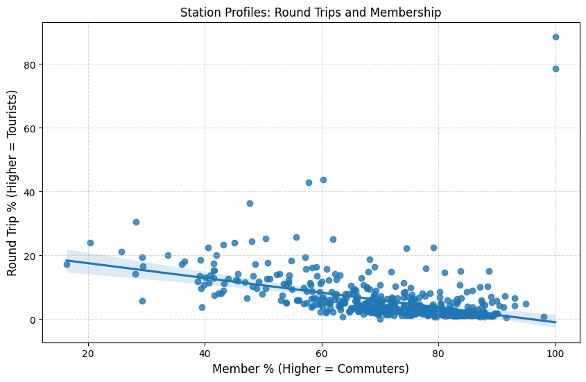
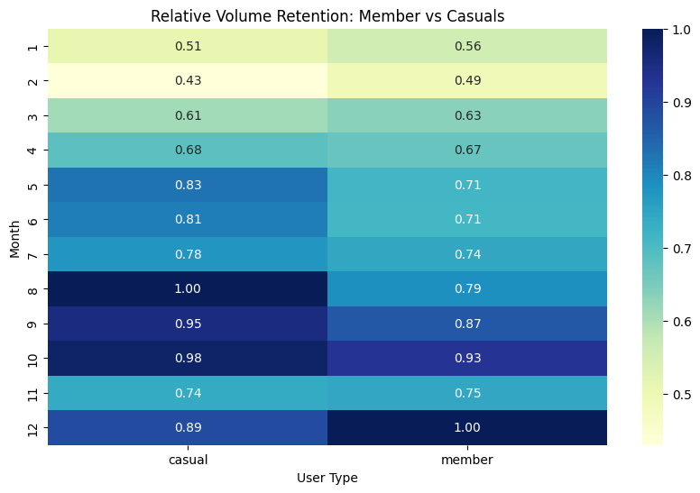
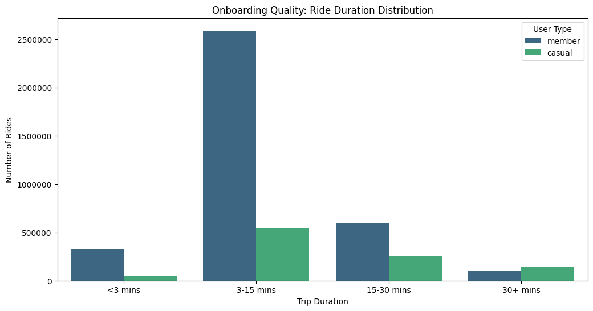
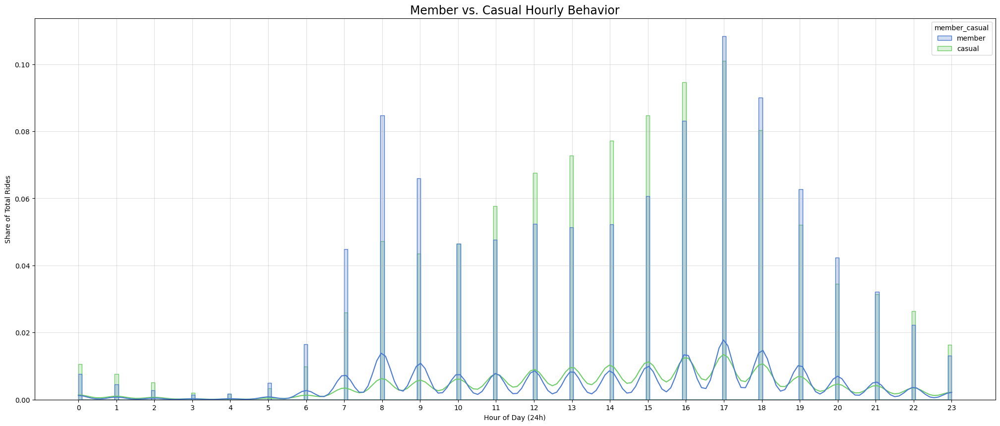
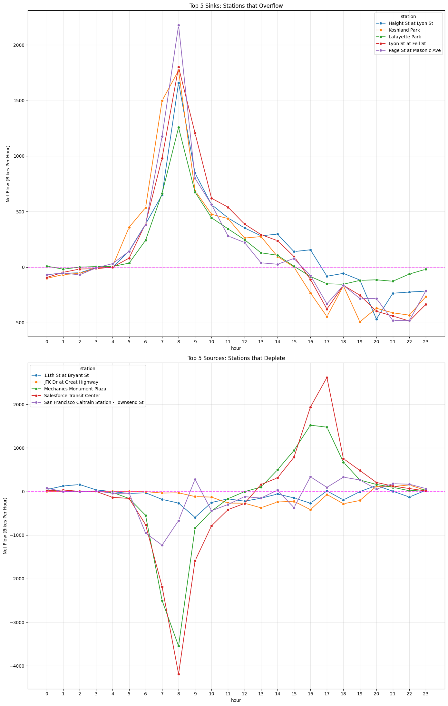

# BayWheels Mobility and Operations Analysis
### An end to end Analysis of Urban Metabolism, Supply-Demand Balance and Growth Blueprints

## Summary
This analysis examines 4.6 million BayWheels ride records to understand user behavior, operational constraints, and scalable growth opportunities in San Francisco’s bike-share network.

The core finding is a structural imbalance I call the Assymetric commute: bike-share is heavily relied upon for time-sensitive morning commutes, but far fewer riders use the system for their evening return trip. This creates station-level deficits that cannot self-correct and must be resolved through manual rebalancing.

## About Data
For this project I analyzed BayWheels Data from 12.2024 to 12.2025. 
- [The link to the dataset](https://www.lyft.com/bikes/bay-wheels/system-data)

## Phase 1. User Behavior

**Goal:** Identify *who* and *when* use bikes to define core users archetype.

### 1.1. Commuters vs. Tourists: Behavioral Segmentation

In the absence of user identifiers, I inferred human behavior through membership status and trip geometry.

I focused on:

- Member vs. Casual split, using membership as a proxy for retention.

- Station pairings, distinguishing point-to-point commute corridors from round-trip.

**Key fidings:**

Casual riders are approximately 3x more likely to be riding for sighseeing or experience (round trips) than Members, who are likely using bikes for point-to-point utility or commuting.

Two dominant archetypes:
- Utility-driven commuters (members) ride for efficiency
- Exploratory or recreational riders (casuals) use cycling as a leisure

### 1.2. Station-level Retention and Churn Risk

I used station-level return patterns as a proxy for churn.

Stations with:
- high casual volume
- low membership %
- high round-trip rates

were identified as experience-first location.

Examples:

- *West Crissy Field* and *Lincoln Blvd at Hoffman St* show 11–13K rides, low membership (20–40%), and high round-trip behavior, consistent with sightseeing use.

- *23rd St at Santa Clara St* and *Saint James Park* show high membership (~78%) alongside moderate round trips (16–22%), suggesting locals using bikes for recreational loops, not tourists.

Outliers with extremely high membership and round-trip rates (80–90%) were removed using the IQR method.

### 1.3. Seasonality and Reliability of Demands
To measure station stability I calculated a Coefficient of Variation (CV) on the monthly ride counts:
- Low CV -> reliable commuter demand
- High CV -> seasonal, weather-sensitive usage

Casual riders show ~5% churn increase starting in November, while members continue riding despite seasonal changes.

Importantly, casual retention remains high suggesting many unsubscribed are residents, not only tourists.

### 1.4. Onboarding Quality
I bucketed ride duration and analyzed return rates within short time windows to evaluate onboarding success.

The *3–15 minute range* emerges as the system’s sweet spot:
long enough to experience value, short enough to feel efficient.

Short rides (<3 minutes) were classified as:

- Technical failure: short + same-station return

- Last-mile success: short + different-station return

**Findings:**

*Last-mile success:*
- Members: 298,854 rides
- Casuals: 30,015 rides

*Technical failures:*
- Casuals: 12,837 rides
- Members: failures account for only ~9% of their short trips

For casual riders, roughly 1 in every 2.3 short trips fails due to technical issues. Members appear either better at identifying faulty bikes or more tolerant due to subscription costs.

#### Separating technical failures from Exploration.

To see if short round trips reflect failure or leisure exploration, I compared weekday vs. weekend behavior.

Hypothesis:
- Failures should occurr at similar rates on weekdays and weekends
- Exploration should spike on weekends

At key leisure stations, short round trips increase 22–24% on weekends, indicating that most of these rides are intentional exploration, not system failure.

### 1.5. Loyalty Behavior

I defined a gold standard member profile across:
- Time (when rides occur)
- Directionality (point-to-point vs loop)
- Efficiency (duration)
- Consistency (weekday vs. weekend balance)

Both members and casuals (~80%) prefer electric bikes, making hardware s secondary differentiator.

*The Member Profile:*
- Median ride is only 8.5 mins
- Nearly 78% of their rides happened during the work week and almost half (47.7%) during rush hour
- Low round-trip rate of 1.7%
- High-frequency, short-duration, weekday-heavy, point-to-point utility.

*The Casual Profile:*
- Average duration roughly 2x longer
- They're less likely to ride during rush hour (39%)
- 3.5x higher round-trip rate (6.1%)
- Low-frequency, long-duration, weekend-leaning, exploratory loops.

**Conclusion:** There's a Subset of Casual riders who represent 64% of casual volume on weekdays and roughly 39% during rush hour. They *act* like members. The Churn isn't a problem in the product, the subscription conversion is.

In this graph above we can see the hourly dynamic of User's behavior based on their type (Member vs. Casual).

## Phase 2. Operations 
**Goal:** Identify structural imbalances that require manual intervention.

### 2.1. Sources, Sinks and Asynetric Commute
I analyzed net flow by station:

- Sources: net negative flow (bikes leave)
- Sinks: net positive flow (bikes accumulate)

**Key Finding:** Transit hubs act as morning sources but do not reverse in the evening. Riders depend on bikes to get to work but switch modes to return home.

As a result:

- Transit hubs end the day in bike debt
- The system cannot self-correct without vans

Residential and park stations show **artificial inflow spikes in early morning**, likely caused by overnight rebalancing so commuters can deplete them by 9AM.

Without this intervention, the morning commute would fail.

### 2.2. Operational Implications
**Conclusions:**

- Stations that do not naturally rebalance to zero should be prioritized for maintenance and monitoring.

- One-way hubs should receive bike drop-offs ~30 minutes before depletion begins, reducing van idle time and fuel costs.

### 2.3. Asset Usage and Battery Risk

Since 79% of all rides on electric bikes Electric, battery logistics become a critical operational constraint. Classic bikes can serve as a "risk buffer" as they:
- don't have charging dependency
- provide fallback capacity

## Phase 3. Growth
Goal: Study how different stations operate in case of scaling to another city.

#### Station Typology
Stations were classified into:
- Commuter Hubs: rush-hour dominant
- Leisure Zones: weekend and late-evening dominant
- Hybrid Zones: balanced usage

#### Insights

**1. Commuter Hubs**
- Highest volume (15–16K average/median rides)
- No strong preference between classic and electric
- Most stable demand profile

**2. Hybrid Zones**
- Largest gap between classic and electric usage
- Members strongly prefer electric bikes

**3. Leisure Zones**
- Highest electric + member usage (~17K average)
- Even leisure riding is dominated by subscribed users

#### Growth Conclusions:
**1. Commuter Hubs:**
- Optimize dock availability and charge readiness
- Stability over experimentation

**2. Hybrid Zones**

- Replace older classic bikes with electric to unlock incremental revenue

**3. Leisure Zones**
- Stage newest, highest-quality e-bikes before weekends
- Members are power users even in recreational contexts

## Final Takeaway
After end-to-end analysis I came to the conclusion that the biggest challenge is aligning user intent with pricing, hardware and operations.

What can be done in the future:
- convert existing behavior into suscriptions
- reduce operational drag
- scale to new cities with a repeatable playbook
